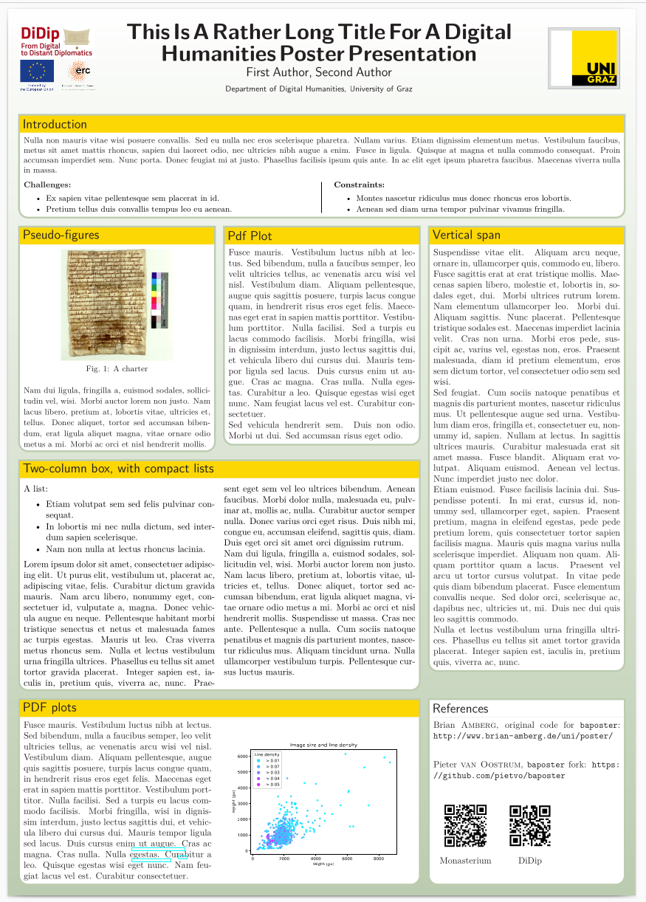

# A template for UniGraz-DH poster

This template is based on the `baposter` class written by Brian Amberg and now maintained by Pieter van Oostrum:



```
# with the baposter.cls file in the same directory
$ pdflatex poster
```

Licence GPL
(c) 2007-2011 Brian Amberg and Reinhold Kainhofer
(c) 2022 Pieter van Oostrum

The original source can be found at:


Download the more recent class file from 


